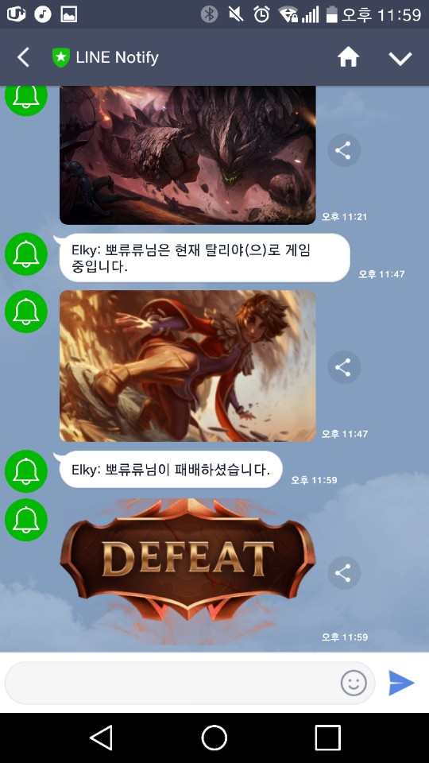

[](https://elky84.github.io)


# loltracer(롤 추적기)

## Requirements
- JDK : 1.8
- Maven : 3.3.9
- DB : MariaDB 10.1
- 라인 계정

## Getting Started
1. lolhuni/src/main/resources/application.yml 파일 수정
    - baseUrl : 한국이면 그대로, 외국서버면 해당 서버에 맞게 변경 필요.
    - lineNotifyAccessToken : lineNotify 토큰 발급 후 기입 <https://notify-bot.line.me/my/>
    - datasource 부분 본인 DB에 맞도록 변경
2. db의 api_key에 `Riot Api Key` 추가
    - 반드시 KEY_NAME은 lol로 해야함.
    ```sql
    - INSERT INTO `loltracer`.`api_key` (`KEY_NO`, `KEY_NAME`, `KEY_VALUE`) VALUES ('1515', 'lol', 'apiKey');
    ```

## 예시

